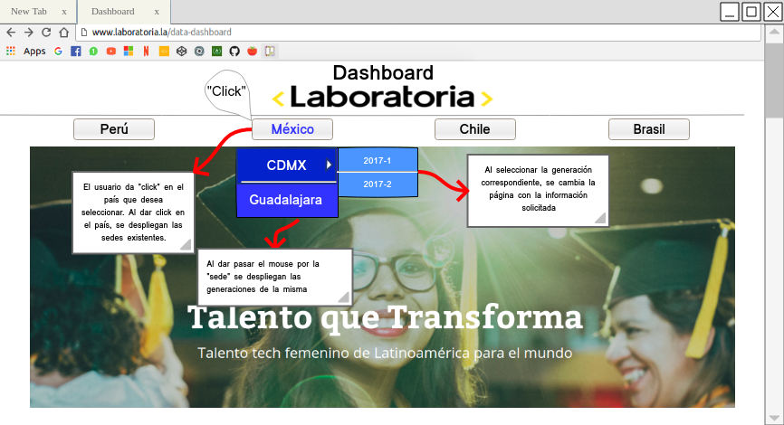
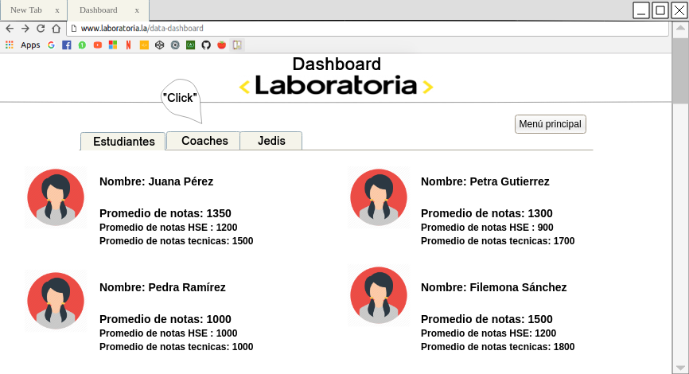
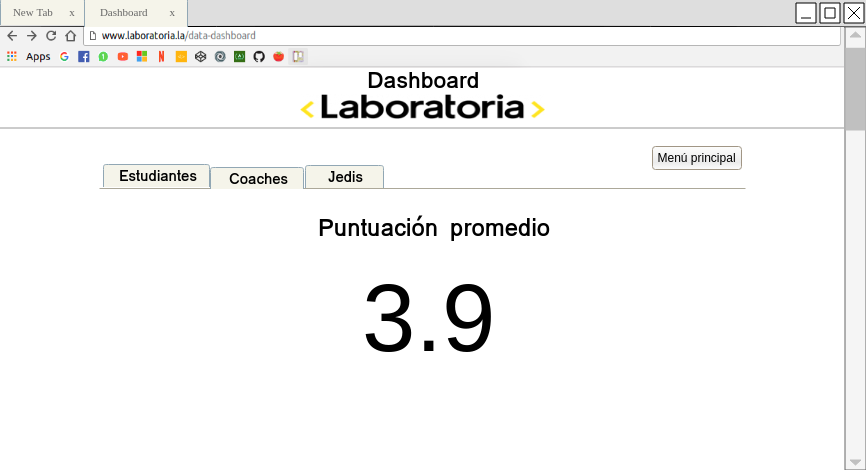

# DATA DASHBOARD

## DESCUBRIMIENTO

**LLUVIA DE IDEAS**

Se indagó sobre las posibles causas que pueden generar la necesidad del Data Dashboard y en la lluvia de ideas de los posibles problemas que pueden tener los training managers y el equipo en general, se mencionaron las siguientes: los datos que manejan no están organizados de manera eficiente, encontrar información/alumnas no resulta muy fácil, les gustaría tener la posibilidad de separar la información para poder manejarla por secciones y así se procese más fácilmente, el tiempo de navegación puede ser un problema ya que se tarda mucho tiempo buscando la información, se tiene mucha información y manejarla toda al mismo tiempo puede resultar muy abrumador.

**ENCUESTAS**

Entrevista a Karla Rejas, Training Manager de Laboratoria en la sede de la Ciudad de Guadalajara, dos años y ocho meses laborando para la institución.

**¿Actualmente como recaudas información de las estudiantes?**

Por medio de excel y formularios.

**¿Con que frecuencia tienes que acceder a toda esta data?**

Todos los días.

**¿Cuánto tiempo te lleva realizar una búsqueda?**

Depende del tipo de información que necesito encontrar.

**¿Sueles acceder a información de otras sedes?**

Si, todo el tiempo, utilizando sus carpetas de Drive.

**¿Cuál es tu sentir al tener que invertir tanto tiempo?**

 Me estresa, no por lo difícil, sino porque siento que es una pérdida de tiempo y yo podría estar dando más tiempo en hacer otras cosas para ustedes, para las estudiantes y no estar metiéndome a hacer miles de excel de hecho, aquí (sede Gdl), se nos hace fácil, porque a mi se me da mucho de trabajar con hoja de cálculo, pero en otras sedes sí se, incluso la asistencia es de forma manual, yo digamos he tratado de automatizar todo, aun así, vean el tiempo que me toma, todo está automatizado, las asistencias en otro lado cuentan una por una, digamos cuentan y le van restando una, acá el conteo está automatizado, el conteo se degrada, pero ¿porque?, porque a otras TM se les hace difícil y no necesariamente tienes que saber eso, las habilidades son diferentes y se hace como un poco pesado ya que invierten muchísimo tiempo.

 **Temas importantes:**

 * Número de estudiantes inscritas.
 * Número de estudiantes que desertaron.
 * Número y % de estudiantes que pasan el criterio mínimo de evaluación.
 * Promedio de notas por sprint (Final).
 * Promedio de notas HSE.
 * Promedio de notas técnicas.

 **Notas:**

 1. Lo mas difícil es emparejar estos resultados con el código de alumna de cada alumna.
 2. El formato de excel se le facilita mucho a la training manager pero no es optimo.
 3. Las notas finales se sacan por Sprint.
 4. Se saca el promedio de todos los “quizzes”
 5. No utiliza gráficas pero seria muy positivo.
 6. La data es demasiada información, la cuál es muy pesada para las computadoras.
 7. Le gustaría una gráfica que muestre todos los aspectos a evaluar de forma visual para saber cuál es el área en dónde la alumna está teniendo problemas para desarrollarse.
 8. Gráficas que incluyan las notas de las estudiantes en las áreas de desarrollo, en resumen, por sprint y promedio.
 9. Accede a toda la información por medio de excel y form.
 10. Todos los filtros son por sede y por generación.

***

*Nombre Completo:*
Lucile Baratier

*Sede a la que perteneces:*
CDMX

*Puesto:*
Training Manager

**Actualmente, ¿Cuál es la forma en que recabas data de las alumnas?**
Por excel.

**¿Con que frecuencia accedes a esta data?**
Todos los días.

**¿Utilizas una plataforma donde puedes acceder a información actualizada que requieres de las alumnas?**
Sí
No x
(Si respondiste que SÍ) **a.¿Cuál es?**
¡Ojalá tuviera!.

**b.¿Cómo funciona?**
No tengo.

**c.¿A cuales problemáticas te enfrentas al acceder a cierta información?**
Todo está en excel, entonces si quieres ver la data consolidada y ponerla en perspectiva con otro resultado/indicador toma mucho tiempo y no es muy agil.

**d.¿Te es fácil entender su contenido al navegar en ella? ¿Por qué?**
No me es fácil navegar en excel y consolidar la información.

**e.¿Qué te gustaría que tuviera para facilitar su navegación y encuentres rápidamente lo que buscas?
(Si respondiste que NO) a. ¿Cómo te gustaría que funcionara?**
Una plataforma o una herramienta web conectada a la data y que genere los resultados automáticamente.

**Actualmente, ¿Qué herramientas utilizas para graficar y clasificar data?**
Excel.

**En caso de utilizar gráficas, ¿cuál de ellas te es más útil?**
% de estudiantes por arriba del 70% de los puntos y % de estudiantes por debajo.

**¿Con que frecuencia tienes que actualizar data de las alumnas?**
Cada sprint.

**¿Cuánto tiempo dedicas a actualizar data?**
Casi 2 horas/día.

**¿Cuál es tu sentir al tener que invertir esa cantidad de tiempo?**
Es mucho tiempo que no debería de invertir en esto pero en cosas más importantes.

**Si tuvieras una herramienta que te optimice los tiempos y facilite tu trabajo, ¿Cómo te sentirías?**
¡Feliz!

***

*Nombre Completo:*
Alejandra Ramirez

*Sede a la que perteneces:*
Lima

*Puesto:*
Training Manager

**Actualmente, ¿Cuál es la forma en que recabas data de las alumnas?**
A través de encuestas (self assessment cada semana, form de feedback al final de cada proyecto); a través de las evaluaciones técnicas de los retos y productos finales; y a través de las evaluaciones de habilidades blandas con los jedis.

**¿Con que frecuencia accedes a esta data?**
La veo con mayor intensidad al final de cada proyecto (sprint).

**¿Utilizas una plataforma donde puedes acceder a información actualizada que requieres de las alumnas?**
Sí x
No
(Si respondiste que SÍ) **a.¿Cuál es?**
Google drive.

**b.¿Cómo funciona?**
Son muchos spreadsheets! En los spreadsheets voy recolectando toda la info de las estudiantes.

**c.¿A cuáles problemáticas te enfrentas al acceder a cierta información?**
Que no está centralizada, son varios archivos con información distinta y es pesado a veces revisar todo para tener una idea general del estatus de las estudiantes.

**d.¿Te es fácil entender su contenido al navegar en ella? ¿Por qué?**
Es fácil porque ya lo conozco pero considero que no es amigable para mi como usuaria.

**e.¿Qué te gustaría que tuviera para facilitar su navegación y encuentres rápidamente lo que buscas?**
Filtros y gráficas que me resuman la información.

(Si respondiste que NO) **a. ¿Cómo te gustaría que funcionara?**

**Actualmente, ¿Qué herramientas utilizas para graficar y clasificar data?**
¡Solo excel!

**En caso de utilizar gráficas, ¿cuál de ellas te es más útil?**
Me gustan las gráficas de barras o de pie dependiendo de la info que muestren.

**¿Con que frecuencia tienes que actualizar data de las alumnas?**
Al menos cada 3/4 semanas.

**¿Cuánto tiempo dedicas a actualizar data?**
Uf!! varios días, unos 3 creo.

**¿Cuál es tu sentir al tener que invertir esa cantidad de tiempo?**
Es un poco estresante porque hay presión de tiempo para tener todo listo y poder entregar a las estudiantes el feedback que necesitan.

**Si tuvieras una herramienta que te optimice los tiempos y facilite tu trabajo, ¿Cómo te sentirías?**
¡Feliz!

***

*Nombre Completo:*
Valentina Smith

*Sede a la que perteneces:*
Santiago

*Puesto:*
Training Manager

**Actualmente, ¿Cuál es la forma en que recabas data de las alumnas?.**
A través de encuestas en google form o de spredsheats que les paso por slack.

**¿Con que frecuencia accedes a esta data?**
¡Todos los días!

**¿Utilizas una plataforma donde puedes acceder a información actualizada que requieres de las alumnas?**
Sí x
No
(Si respondiste que SÍ) **a.¿Cuál es?**
Google form a través de drive.

**b.¿Cómo funciona?**
Bien, pero está diseminada.

**c.¿A cuales problemáticas te enfrentas al acceder a cierta información?**
Que no está centralizada!

**d.¿Te es fácil entender su contenido al navegar en ella? ¿Por qué?**
Sí, pero no está toda agrupada.

**e.¿Qué te gustaría que tuviera para facilitar su navegación y encuentres rápidamente lo que buscas?**
Los resultados de las alumnas, los puntos, cómo se están sintiendo en clases, etc.

(Si respondiste que NO) **a. ¿Cómo te gustaría que funcionara?**

**Actualmente, ¿Qué herramientas utilizas para graficar y clasificar data?**
Mmm hago gráficos en excel.

**En caso de utilizar gráficas, ¿cuál de ellas te es más útil?**
Las gráficas de torta.

**¿Con que frecuencia tienes que actualizar data de las alumnas?**
Todas las semanas.

**¿Cuánto tiempo dedicas a actualizar data?**
Una hora diaria.

**¿Cuál es tu sentir al tener que invertir esa cantidad de tiempo?**
¡Siento que es demasiado!

**Si tuvieras una herramienta que te optimice los tiempos y facilite tu trabajo, ¿Cómo te sentirías?**
¡Mucho más aliviada!

**DESCUBRIMIENTO DE LAS ENTREVISTAS / ENCUESTAS**

**El acceso a la data se encuentra disperso**   

Al mostrar la data de las alumnas de manera ordenada y clasificada por medio de un dashboard:

* Promedio de notas por sprint.
* Promedio de notas HSE.
* Promedio notas técnicas

Se obtendrá un acceso fácil y rápido a la data y se invertirá poco tiempo para procesar dichos datos, de igual manera, el sentimiento de estrés o frustración será mermado y se trabajará de manera optima, obteniendo más productividad.

**Únicamente acceden  a los datos por medio de Excel y formularios**

Por lo tanto, es una excelente idea realizar un dashboard en donde se encuentre toda la información de manera clasificada, obteniendo data de todas las sedes (Gdl, CDMX, Santiago de Chile, Aréquipa, Lima, Sao Paulo).

**No utilizan gráficas para analizar los datos**

Al utilizar gráficos se facilita la comprensión, comparación y análisis de datos.

## DEFINICIÓN

**HIPOTESIS**

La falta de datos organizados provoca que se invierta mucho tiempo en la búsqueda de información, no se puede realizar el trabajo de manera optima, lo que se traduce en baja productividad.

**OBJETIVO PRINCIPAL**

Obtener un acceso fácil y rápido a dicha data, mejorar el análisis de la misma y procesar información de manera efectiva.

**PROBLEMA PRINCIPAL DE TRAINING MANAGERS**

Con la investigación se tomó como referencia entrevistas a training managers de diferentes sedes de Laboratoria. Se resumieron los puntos comunes, asi que se decidió enfocarse en los problemas principales que se pueden enfrentar al manejar toda esta información, los más sobresalientes son los siguientes:

* Empatar información de las alumnas.

* Hay mucha data y se encuentra dispersa.

* Se recaba la información en excel, por lo que es más difícil su análisis y procesamiento.

* Difícil manejo de información de otras generaciones pasadas.

* No se usan gráficos actualmente, pero usarlos resultaría muy útil.

* Las alumnas no tienen acceso directo a esta data.

* Saturación de computadora por los documentos con la data.

* Se pierde mucho tiempo realizando la búsqueda de la información.  

* No hay acceso directo para información de otras sedes.

* En algunas sedes se realizan los cálculos de los procesos de manera manual.

**PRUEBAS Y RESULTADOS - LLUVIA DE IDEAS**

Conforme las entrevistas que se realizaron y analizando la lluvia de ideas inicial, se pueden confirmar algunos supuestos que se habían establecido en el inicio: la data que se maneja no está organizada de manera eficiente, empatar/encontrar la información de las alumnas es complicado ya que la data se encuentra dispersa, resultaría muy útil manejar y procesar la información de manera organizada y tener acceso directo a la data, se puede optimizar el tiempo de navegación estableciendo accesos directos a información principal.

## PROTOTIPADO

